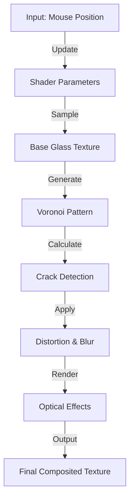
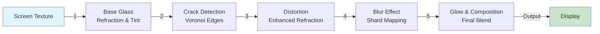
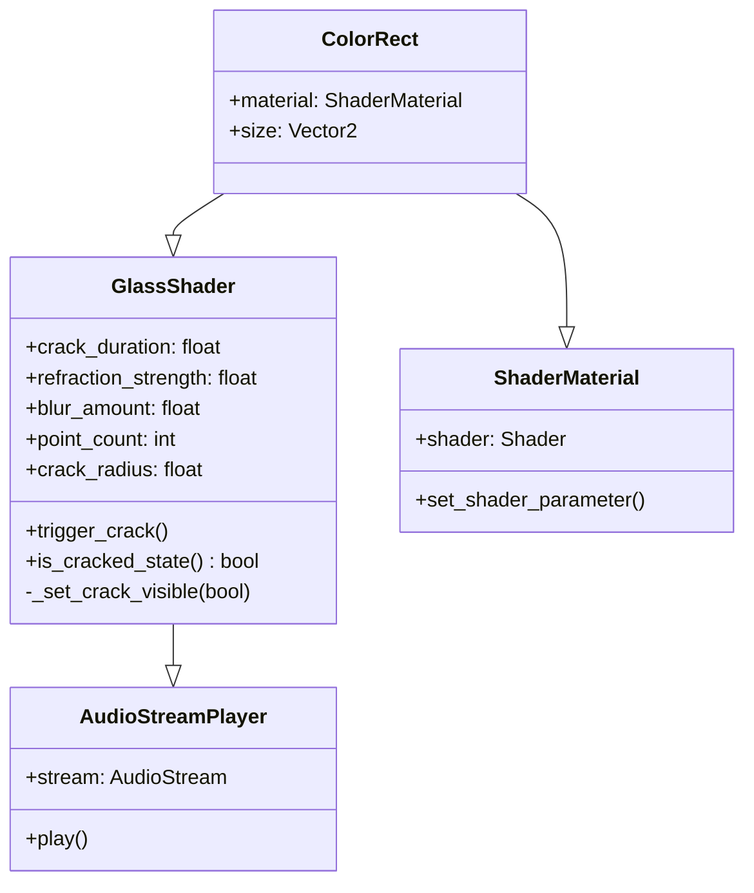
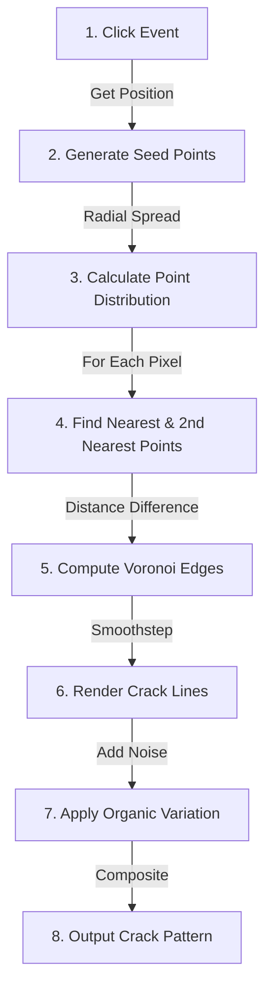
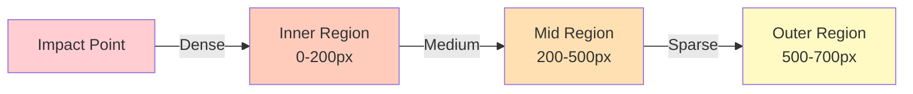
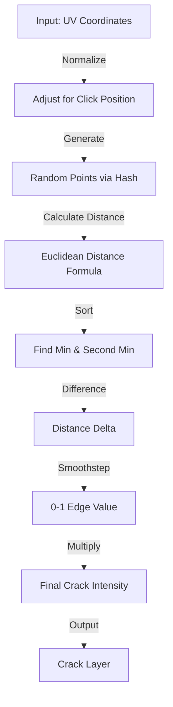

# Impact Glass Shader

Interactive procedural glass crack effect for Godot 4.

<div align="center">


</div>

## Overview

A production-ready shader implementation that generates realistic glass fracture patterns using procedural Voronoi diagrams. Features dynamic distortion, optical refraction effects, and configurable crack propagation for interactive UI feedback and game mechanics.

**Key Features:**
- Procedurally generated Voronoi-based crack patterns
- Optical refraction and dynamic blur effects
- Configurable crack propagation and appearance
- Auto-reset timing with manual control options
- Optimized for real-time rendering across platforms

## Table of Contents

- [Features](#features)
- [Architecture](#architecture)
- [Setup](#setup)
- [Configuration](#configuration)
- [API Reference](#api-reference)
- [Implementation Details](#implementation-details)
- [Performance](#performance)
- [Troubleshooting](#troubleshooting)
- [License](#license)

## Features

| Feature | Description |
|---------|-------------|
| **Procedural Crack Generation** | Voronoi-based fracture patterns radiating from impact point |
| **Optical Refraction** | Light bending effect simulating broken glass surfaces |
| **Dynamic Blur** | Depth-of-field effect concentrated near crack lines |
| **Glass Material Properties** | Subtle tint and refraction across entire surface |
| **Impact Detection** | Instant crack generation at specified coordinates |
| **Configurable Duration** | Automatic reset with adjustable visibility window |
| **Audio Integration** | Built-in support for impact sound effects |
| **Parameter Control** | 10+ adjustable parameters for customization |

### Use Cases

| Scenario | Application |
|----------|-------------|
| User Interface | Breaking interface elements for visual feedback |
| Game Mechanics | Glass breaking targets, destructible shields |
| Damage Visualization | Impact indicators, health state transitions |
| Interactive Art | Installation pieces, procedural animations |
| Transition Effects | Scene changes, screen shatters |

## Architecture

### System Overview



### Rendering Pipeline

The shader processes screen texture through multiple stages:



### Class and Script Structure



## Setup

### Installation

1. **Add the shader file to your project:**
   ```
   res://shader/glassshatter.gdshader
   ```

2. **Create a ColorRect node:**
   ```gdscript
   var glass = ColorRect.new()
   glass.size = get_viewport_rect().size
   add_child(glass)
   ```

3. **Assign the shader material:**
   ```gdscript
   var material = ShaderMaterial.new()
   material.shader = preload("res://shader/glassshatter.gdshader")
   glass.material = material
   ```

4. **Attach the control script:**
   ```gdscript
   glass.set_script(preload("res://scripts/ui_2.gd"))
   ```

### Basic Integration

```gdscript
extends ColorRect

func _ready():
    # Configure crack appearance
    crack_duration = 1.0
    refraction_strength = 4.0
    blur_amount = 1.2
    point_count = 50
    
    # Optional: attach sound effect
    var audio = AudioStreamPlayer.new()
    audio.stream = preload("res://assets/stu9-glass-crack-363162.mp3")
    add_child(audio)
    crack_sound = audio

func _input(event: InputEvent):
    if event is InputEventMouseButton and event.pressed:
        trigger_crack()
```

## Configuration

### Script Parameters (ui_2.gd)

| Parameter | Type | Default | Range | Description |
|-----------|------|---------|-------|-------------|
| `crack_duration` | float | 1.0 | 0.1-10.0 | Visibility window before auto-reset (seconds) |
| `refraction_strength` | float | 4.0 | 0.0-10.0 | Intensity of light distortion around cracks |
| `blur_amount` | float | 1.2 | 0.0-5.0 | Blur radius applied near crack lines |
| `glass_tint` | float | 0.06 | 0.0-1.0 | Glass surface tint intensity |
| `crack_glow` | float | 0.8 | 0.0-2.0 | Brightness multiplier for crack lines |
| `point_count` | int | 50 | 20-100 | Number of seed points for Voronoi pattern |
| `crack_radius` | float | 700.0 | 100-2000 | Maximum propagation distance from impact |
| `crack_thickness` | float | 1.0 | 0.1-5.0 | Visual width of crack lines |
| `crack_color` | Color | Black | — | RGBA color of rendered cracks |
| `crack_sound` | AudioStreamPlayer | null | — | Optional audio feedback on impact |

### Shader Uniforms (glassshatter.gdshader)

| Uniform | Type | Description |
|---------|------|-------------|
| `click_position` | vec2 | World/viewport coordinates of impact point |
| `show_crack` | bool | Toggle crack pattern visibility |
| `crack_intensity` | float | Normalized crack strength (0.0-1.0) |
| `crack_color` | vec4 | Crack line color with alpha channel |
| `heal_amount` | float | Reserved for future healing mechanics |

### Preset Configurations

#### Subtle Glass Effect
```gdscript
refraction_strength = 1.5
blur_amount = 0.5
glass_tint = 0.02
crack_glow = 0.4
point_count = 30
```

#### Aggressive Damage
```gdscript
refraction_strength = 6.0
blur_amount = 2.5
glass_tint = 0.1
crack_glow = 1.5
point_count = 80
crack_thickness = 2.0
```

#### Mobile Optimized
```gdscript
point_count = 25
blur_amount = 0.8
refraction_strength = 2.0
crack_radius = 500.0
```

## API Reference

### Public Methods

#### `trigger_crack()`
Initiates crack generation at current mouse position.

```gdscript
func trigger_crack() -> void
```

**Example:**
```gdscript
glass.trigger_crack()
```

#### `is_cracked_state() -> bool`
Returns whether glass is currently displaying a crack pattern.

```gdscript
func is_cracked_state() -> bool
```

**Example:**
```gdscript
if glass.is_cracked_state():
    print("Glass is damaged")
```

#### `_set_crack_visible(visible: bool)`
Manually control crack visibility without affecting timer.

```gdscript
func _set_crack_visible(visible: bool) -> void
```

**Example:**
```gdscript
glass._set_crack_visible(false)  # Hide crack immediately
```

### Signal Integration

Extend the base script to implement custom signals:

```gdscript
signal crack_triggered(position: Vector2)
signal crack_disappeared

func _show_crack(pos: Vector2):
    crack_triggered.emit(pos)
    # Additional logic here
```

## Implementation Details

### Voronoi-Based Crack Generation

The core algorithm generates realistic fracture patterns using Voronoi diagram principles.

#### Algorithm Overview



#### Voronoi Edge Detection

```glsl
// Core Voronoi calculation
float voronoi_edge(vec2 uv, vec2 points[MAX_POINTS]) {
    float min_dist = distance(uv, points[0]);
    float second_dist = distance(uv, points[1]);
    
    for (int i = 1; i < point_count; i++) {
        float dist = distance(uv, points[i]);
        if (dist < min_dist) {
            second_dist = min_dist;
            min_dist = dist;
        } else if (dist < second_dist) {
            second_dist = dist;
        }
    }
    
    // Edges appear where two regions meet
    return second_dist - min_dist;
}
```

#### Radial Point Distribution

Points are distributed radially with density falloff:



### Shader Processing Stages

#### 1. Base Glass Layer
- Applies subtle refraction using noise-based offsets
- Mixes screen texture with tint color (0.85, 0.9, 0.98 RGB)
- Performs 3x3 blur sampling for smooth appearance

#### 2. Crack Detection
- Calculates Voronoi edges from generated seed points
- Applies smoothstep for edge thickness control
- Adds procedural noise for organic irregularity

#### 3. Distortion & Blur
- Enhances refraction intensity near crack lines
- Maps blur direction based on shard orientation
- Applies variable blur strength proportional to distance from crack

#### 4. Glow & Composition
- Adds glow intensity to crack lines
- Applies central impact glow effect
- Blends base glass with crack regions using smooth transitions

### Mathematical Operations



## Performance

### Computational Complexity

| Component | Complexity | Impact |
|-----------|-----------|--------|
| Point Generation | O(n) | Linear in point count |
| Distance Calculation | O(n²) | Quadratic per pixel |
| Blur Operations | O(k²) | Quadratic in kernel size |
| Overall Per-Frame | O(n² × pixels) | Dominant factor |

### Platform-Specific Optimization

#### Desktop
```gdscript
point_count = 75
blur_amount = 2.5
refraction_strength = 5.0
```
- Supports high-resolution displays
- Handles intensive shader calculations
- Smooth 60+ FPS performance

#### Mobile/Web
```gdscript
point_count = 30
blur_amount = 0.8
refraction_strength = 2.5
```
- Optimized for battery efficiency
- Reduced calculation overhead
- Stable 30-60 FPS

#### Low-End Hardware
```gdscript
point_count = 15
blur_amount = 0.4
refraction_strength = 1.5
```
- Minimal shader workload
- Simplified crack pattern
- Maintains 30 FPS baseline

### Optimization Techniques

1. **Point Count Reduction**: Lower point counts produce coarser crack patterns with 4x performance improvement

2. **Blur Kernel Optimization**: Use directional blur instead of full 2D kernel for 50% reduction in sampling operations

3. **Conditional Rendering**: Only compute expensive operations when `show_crack` is true

4. **Mip-mapping**: Pre-compute noise textures at multiple resolutions

### Profiling Recommendations

```gdscript
# Enable Godot's built-in profiler
Performance.get_monitor(Performance.TIME_PHYSICS_PROCESS)

# Monitor shader execution time
var start = Time.get_ticks_msec()
# Trigger crack
var elapsed = Time.get_ticks_msec() - start
print("Crack generation: %dms" % elapsed)
```

## File Structure

```
Glass-Crack-Shader/
├── assets/
│   ├── stu9-glass-crack-363162.mp3      # Crack impact audio
│   └── stu9-glass-crack-363162.mp3.import
├── scene/
│   └── final.tsn                         # Demo scene
├── scripts/
│   └── ui_2.gd                           # Control script
├── shader/
│   └── glassshatter.gdshader             # Shader implementation
├── LICENSE                               # MIT License
├── project.godot                         # Godot project configuration
└── README.md                             # Documentation
```

## Troubleshooting

### Common Issues and Solutions

| Issue | Cause | Solution |
|-------|-------|----------|
| **No crack appears** | `show_crack` disabled or wrong coordinate space | Verify `show_crack = true` and coordinates are in viewport space |
| **Cracks look blocky** | Insufficient point count or large thickness | Increase `point_count` to 50-80, reduce `crack_thickness` |
| **Performance degradation** | Excessive point count or blur radius | Reduce `point_count` to 30-40, limit `blur_amount` to 1.0-1.5 |
| **Audio not playing** | Missing stream assignment | Assign valid AudioStream to `crack_sound` before triggering |
| **Cracks at wrong position** | Coordinate system mismatch | Use `get_viewport().get_mouse_position()` consistently |
| **Uneven crack distribution** | Poor hash function or seed points | Verify random point generation uses distinct seeds |
| **Shader compilation error** | Missing GLSL extension or syntax | Check shader compiler output in Godot console |

### Debug Logging

```gdscript
# Enable detailed debugging
extends ColorRect

func _ready():
    set_process_input(true)
    print("Glass shader initialized")

func _show_crack(pos: Vector2):
    print("Crack triggered at: %v" % pos)
    print("Current parameters: point_count=%d, duration=%.2f" % [point_count, crack_duration])
    trigger_crack()

func _on_crack_disappear():
    print("Crack animation completed")
```

### Performance Debugging

```gdscript
# Measure shader performance
func benchmark_crack():
    var times = []
    for i in range(10):
        var start = Time.get_ticks_msec()
        trigger_crack()
        await get_tree().process_frame
        times.append(Time.get_ticks_msec() - start)
    
    var avg = times.reduce(func(a, b): return a + b) / times.size()
    print("Average crack generation time: %.2fms" % avg)
```

## Advanced Usage

### Custom Crack Colors

```gdscript
# Dark transparent cracks
material.set_shader_parameter("crack_color", Color(0.1, 0.1, 0.1, 0.8))

# Bright white cracks with transparency
material.set_shader_parameter("crack_color", Color(1.0, 1.0, 1.0, 0.6))

# Colored tint (blue glass cracks)
material.set_shader_parameter("crack_color", Color(0.4, 0.6, 1.0, 0.9))
```

### Dynamic Parameter Tweening

```gdscript
# Gradually increase refraction
var tween = create_tween()
tween.tween_method(func(val): refraction_strength = val, 
                   2.0, 6.0, 0.5)
```

### Procedural Crack Events

```gdscript
# Trigger multiple cracks in sequence
func cascade_cracks():
    for i in range(3):
        trigger_crack()
        await get_tree().create_timer(0.3).timeout
```

## License

This project is licensed under the MIT License.

```
MIT License

Copyright (c) 2026 Lord0Sanz

Permission is hereby granted, free of charge, to any person obtaining a copy
of this software and associated documentation files (the "Software"), to deal
in the Software without restriction, including without limitation the rights
to use, copy, modify, merge, publish, distribute, sublicense, and/or sell
copies of the Software, and to permit persons to whom the Software is
furnished to do so, subject to the following conditions:

The above copyright notice and this permission notice shall be included in all
copies or substantial portions of the Software.

THE SOFTWARE IS PROVIDED "AS IS", WITHOUT WARRANTY OF ANY KIND, EXPRESS OR
IMPLIED, INCLUDING BUT NOT LIMITED TO THE WARRANTIES OF MERCHANTABILITY,
FITNESS FOR A PARTICULAR PURPOSE AND NONINFRINGEMENT. IN NO EVENT SHALL THE
AUTHORS OR COPYRIGHT HOLDERS BE LIABLE FOR ANY CLAIM, DAMAGES OR OTHER
LIABILITY, WHETHER IN AN ACTION OF CONTRACT, TORT OR OTHERWISE, ARISING FROM,
OUT OF OR IN CONNECTION WITH THE SOFTWARE OR THE USE OR OTHER DEALINGS IN THE
SOFTWARE.
```

See [LICENSE](LICENSE) file for complete terms.

## Contributing

Contributions are welcome. Please ensure:

1. Code follows Godot style guidelines
2. Shader changes are documented
3. Performance impact is evaluated
4. All parameters are tested across platforms

## Support & Resources

- **Godot Engine**: [godotengine.org](https://godotengine.org)
- **Shader Documentation**: [Impact Glass Shader](https://godotshaders.com/shader/impact-glass-shader/)
## Creator
**PROJEKTSANSSTUDIOS**
- **GitHub**: [github.com/Lord0Sanz](https://github.com/Lord0Sanz)
- **itch.io**: [projekt-sans-studios.itch.io](https://projekt-sans-studios.itch.io/)
- **Godot Shader**: [PROJEKTSANSSTUDIOS](https://godotshaders.com/author/lord0sanz/)

---

**Version**: 1.0  
**Last Updated**: 2026  
**Godot Compatibility**: 4.6 and later
